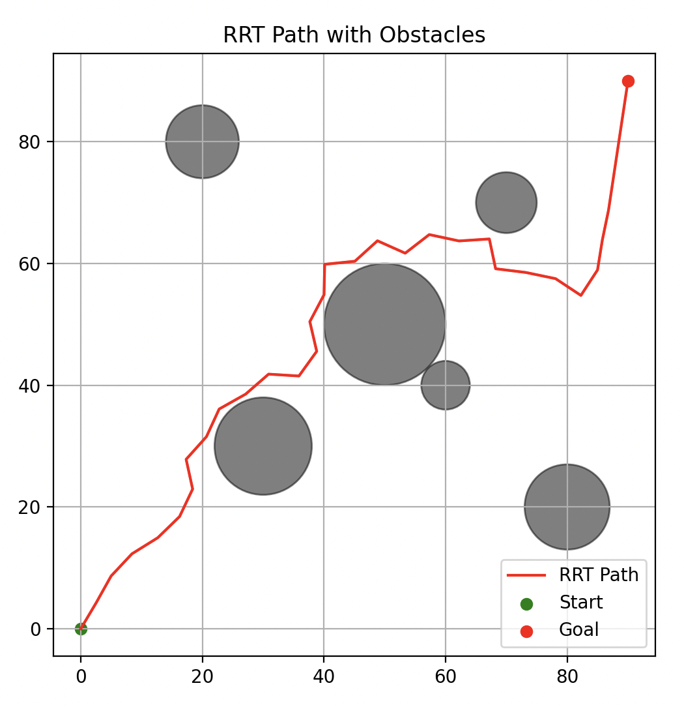
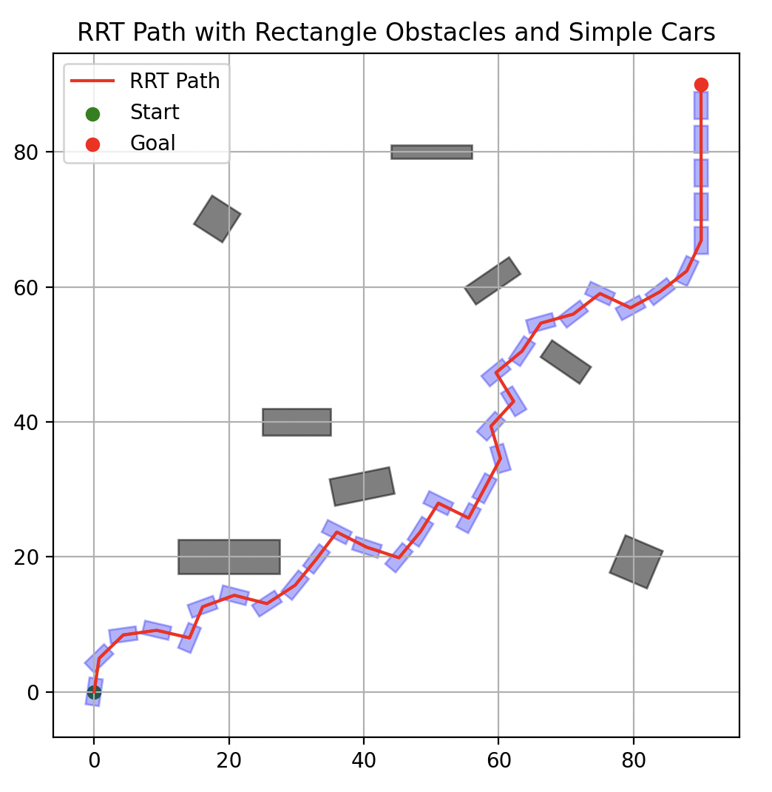

# C++ Planning Algorithms: RRT and RRT*

This project provides a C++ implementation of the RRT  and RRT* algorithms for motion planning in 2D environments.

## Features

- **RRT and RRT***: Implements both standard RRT and the optimized RRT* algorithms for efficient path planning.
- **Circular Obstacle Support**: Supports collision detection and path planning in environments with circular obstacles.
- **RRT* with Simple Bicycle Model**:
  - Incorporates a kinematic bicycle model to simulate realistic vehicle motion.
  - The vehicle is represented as a rectangle.
  - Collision detection is performed using the GJK algorithm, enabling accurate checks against convex obstacles.

```
mkdir build
cd build
cmake ..
make
```

For visual, run the ```path_visual_xxx.py``` in the RRT file.

```
poetry install
poetry run python path_visual_xxx.py
```

Below is an example of a path planned of point using RRT*:



and example of a path planned of bicyle modle using RRT*:


